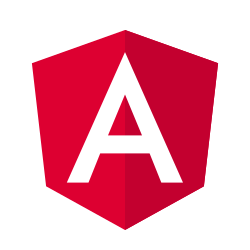

# CURSO DE ANGULAR
👨‍⚖️ANGULAR É UM FRAMEWORK DE DESENVOLVIMENTO WEB CRIADO PELO GOOGLE, QUE PERMITE A CRIAÇÃO DE APLICAÇÕES WEB ROBUSTAS E DINÂMICAS USANDO JAVASCRIPT OU TYPESCRIPT. ELE FORNECE UMA ESTRUTURA PARA ORGANIZAR O CÓDIGO, GERENCIAR O ESTADO DA APLICAÇÃO E CRIAR COMPONENTES REUTILIZÁVEIS.

  

## CONCEITO:
Angular é um framework de desenvolvimento front-end para a construção de aplicativos da web de página única (SPA - Single Page Applications) e aplicativos da web dinâmicos. Ele é mantido pelo Google e uma comunidade ativa de desenvolvedores. Aqui estão os principais aspectos e conceitos do Angular:

1. **Componentes**: Angular é baseado em um padrão de arquitetura de componentes, onde os aplicativos são construídos a partir de componentes reutilizáveis. Cada componente encapsula uma parte da interface do usuário e seu comportamento.

2. **Data Binding**: Angular oferece data binding bidirecional, o que significa que as alterações feitas no modelo (dados) são refletidas automaticamente na visualização (interface do usuário) e vice-versa. Isso simplifica a manipulação e sincronização de dados entre o modelo e a visualização.

3. **Diretivas**: As diretivas são instruções na forma de atributos, elementos ou classes CSS que fornecem funcionalidades adicionais aos elementos DOM. Angular possui várias diretivas integradas e permite que os desenvolvedores criem suas próprias diretivas personalizadas.

4. **Serviços**: Os serviços são classes reutilizáveis que encapsulam a lógica de negócios e podem ser injetados em componentes e outros serviços. Eles são usados para compartilhar dados, realizar chamadas de API, manipular eventos e outras tarefas comuns em um aplicativo.

5. **Roteamento**: O roteamento no Angular permite a navegação entre diferentes partes do aplicativo, carregando os componentes apropriados e atualizando a URL do navegador. Isso é fundamental para criar aplicativos de página única (SPA) com várias visualizações.

6. **Módulos**: Os módulos no Angular são contêineres para organizar os componentes, diretivas, serviços e outros recursos do aplicativo. Eles ajudam a modularizar o aplicativo e a manter uma estrutura limpa e organizada.

7. **Injeção de Dependência**: Angular usa injeção de dependência para fornecer componentes e serviços com suas dependências. Isso facilita a criação de aplicativos com código mais modular, testável e fácil de manter.

8. **CLI (Command Line Interface)**: Angular fornece uma CLI poderosa que simplifica o processo de criação, desenvolvimento, teste e implantação de aplicativos Angular. Ele oferece comandos para gerar componentes, serviços, módulos, testes e muito mais.

9. **Ecossistema de Ferramentas**: Angular possui um rico ecossistema de ferramentas, bibliotecas e plugins que complementam o framework e facilitam o desenvolvimento de aplicativos. Isso inclui bibliotecas de terceiros, como Angular Material para design de interface do usuário, NgRx para gerenciamento de estado e muito mais.

## SUA HISTÓRIA:
1. **AngularJS (2010)**: O AngularJS foi lançado pelo Google em 2010. Foi desenvolvido por Misko Hevery e Adam Abrons como uma estrutura para a construção de aplicativos da web de página única (SPAs). AngularJS introduziu conceitos inovadores, como data binding bidirecional e injeção de dependência, simplificando o desenvolvimento de aplicativos da web.

2. **Popularidade do AngularJS**: AngularJS ganhou rapidamente popularidade entre os desenvolvedores devido à sua abordagem intuitiva e eficaz para o desenvolvimento de aplicativos da web. Ele foi amplamente adotado em muitos projetos e empresas em todo o mundo.

3. **AngularJS 2.0 (2014)**: Em 2014, o Google anunciou uma grande atualização para o AngularJS, chamada Angular 2.0. No entanto, Angular 2.0 foi uma reescrita completa da estrutura, com mudanças significativas na arquitetura e na sintaxe em relação à versão anterior.

4. **Angular (2016)**: O Angular 2.0 foi lançado oficialmente como Angular em setembro de 2016, seguido por várias versões subsequentes. O Angular abandonou a nomenclatura "AngularJS" para refletir as diferenças fundamentais entre o Angular e sua versão anterior. Angular introduziu melhorias de desempenho, modularidade e uma arquitetura mais robusta.

5. **Ciclo de Lançamento Regular**: Desde o lançamento do Angular, o Google adotou um ciclo de lançamento regular, com novas versões sendo lançadas a cada seis meses. Isso permitiu que o Angular evoluísse rapidamente, incorporando novos recursos, melhorias de desempenho e correções de bugs de forma consistente.

6. **Adoção e Comunidade Ativa**: Angular ganhou uma ampla adoção na indústria devido ao seu suporte do Google e à sua comunidade ativa de desenvolvedores. Muitas empresas e organizações líderes adotaram o Angular para o desenvolvimento de seus aplicativos da web, contribuindo para o seu crescimento contínuo e sucesso.

7. **Evolução Contínua**: O Angular continuou a evoluir ao longo dos anos, com a introdução de novos recursos e aprimoramentos em cada versão. Algumas das principais atualizações incluem a introdução de Angular Universal para renderização do lado do servidor, Angular CLI para simplificar o processo de desenvolvimento e Angular Ivy como uma nova geração de mecanismo de renderização.

## CARACTERISTICAS:
### POSITIVAS:
1. **Estrutura Modular e Organização**: O Angular promove uma estrutura organizada e modular para o desenvolvimento de aplicativos. Os módulos, componentes e serviços facilitam a organização do código.

2. **Injeção de Dependência**: O sistema de injeção de dependência do Angular torna o código mais modular e reutilizável, facilitando a manutenção e o teste.

3. **Roteamento Integrado**: O Angular fornece um sistema de roteamento completo que permite criar aplicativos de várias páginas com facilidade.

4. **Tipagem Estática**: O Angular usa o TypeScript, que é um superconjunto do JavaScript com tipagem estática. Isso ajuda a detectar erros de compilação durante o desenvolvimento.

5. **Ferramentas e Ecossistema**: Angular é apoiado pelo Google e tem um ecossistema maduro de ferramentas, bibliotecas e recursos adicionais, como o Angular CLI.

6. **Suporte a Aplicativos Móveis**: O Angular possui o Ionic Framework, que permite o desenvolvimento de aplicativos móveis híbridos usando tecnologias web.

7. **Performance**: O Angular oferece mecanismos eficientes para otimização de desempenho, como detecção de mudanças, carregamento preguiçoso de módulos e AOT (Ahead-of-Time) compilation.

### NEGATIVA:
1. **Curva de Aprendizado**: Angular pode ter uma curva de aprendizado mais íngreme, especialmente para iniciantes, devido à complexidade de seus conceitos.

2. **Verbosidade**: O Angular pode parecer mais verboso em comparação com outros frameworks mais leves, o que pode levar a uma quantidade maior de código.

3. **Complexidade**: Para aplicativos simples, o Angular pode ser excessivamente complexo. Ele pode ser uma escolha exagerada para projetos menores.

4. **Tamanho do Pacote**: Os aplicativos Angular podem gerar pacotes maiores em comparação com alguns outros frameworks, o que pode impactar o tempo de carregamento da página.

5. **Dependência de Terceiros**: O Angular inclui muitas funcionalidades internas, o que pode aumentar o tamanho do pacote e a dependência de terceiros.

6. **Migração entre Versões**: Migrações entre diferentes versões do Angular podem ser desafiadoras, especialmente quando mudanças significativas são introduzidas.

7. **Dificuldade de SEO**: O Angular é um framework baseado em JavaScript, o que pode tornar o SEO (otimização para mecanismos de busca) mais desafiador em comparação com aplicativos mais tradicionais.

## TRABALHANDO COM ANGULAR:
Trabalhar com o Angular é relativamente simples, especialmente quando se utiliza o Angular CLI, que automatiza muitas tarefas. Aqui está uma explicação simplificada:

**1. Instalação Inicial:**
   - Inicialmente, você precisa ter o Node.js instalado em seu sistema.
   - Em seguida, você instala o Angular CLI globalmente com o comando `npm install -g @angular/cli`. Isso permite que você crie e gerencie projetos Angular em qualquer lugar.

**2. Criar um Novo Projeto:**
   - Usando o Angular CLI, você pode criar um novo projeto Angular com um único comando, como `ng new nome-do-seu-projeto`.
   - O Angular CLI cuida de configurar toda a estrutura do projeto para você.

**3. Estrutura do Projeto:**
   - A maior parte do trabalho acontece na pasta `src/app`. Aqui estão os principais pontos:

      - **src/app/app.component.ts:** Este é o arquivo que define o componente raiz do aplicativo.
      - **src/app/app.component.html:** Aqui você define o template HTML do componente raiz.
      - **src/app/app.component.css (opcional):** Pode conter estilos CSS específicos do componente raiz.

**4. Componentes e Módulos:**
   - Você pode criar componentes adicionais usando o comando `ng generate component nome-do-seu-componente`.
   - Os componentes são organizados em subpastas dentro de `src/app`.
   - Você pode criar módulos para agrupar componentes relacionados usando o comando `ng generate module nome-do-seu-modulo`.

**5. Servidor de Desenvolvimento:**
   - Você inicia o servidor de desenvolvimento com o comando `ng serve`. Isso permite que você veja o aplicativo em execução em `http://localhost:4200` e atualizações em tempo real enquanto você faz alterações no código.

**6. Personalização:**
   - Você pode personalizar os componentes e modelos em `src/app` para criar a interface do usuário desejada.
   - Pode adicionar serviços e outros recursos conforme necessário para implementar a lógica de negócios do aplicativo.

**7. Teste e Implantação:**
   - O Angular CLI oferece comandos para criar testes e construir o aplicativo para implantação.

## SUBSIDIOS:
- [CURSO CRIADO PELO "MATHEUS BATTISTI"](https://youtube.com/playlist?list=PLnDvRpP8Bnex2GQEN0768_AxZg_RaIGmw&si=1iAmXfOemX42j5ny)
- [CURSO FEITO PELO VILHALVA](https://github.com/VILHALVA)
- [VEJA A DOCUMENTAÇÃO](https://angular.io/docs)
- [LINGUAGEM DE PROGRAMAÇÃO](https://github.com/VILHALVA/CURSO-DE-JAVASCRIPT)
- [VEJA A SINTAXE](./SINTAXE.md) 